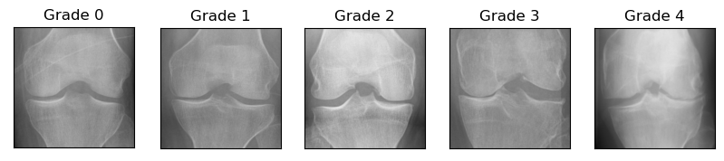
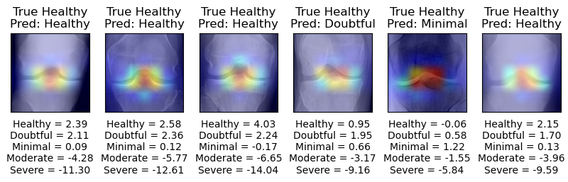

# Knee Osteoarthritis Analysis with X-ray Images using Deep Convolutional Neural Networks

## Knee Osteoarthritis

[Knee osteoarthritis](https://en.wikipedia.org/wiki/Knee_arthritis) is a pathology that occurs due to wear on the cartilage that protects the bones in this region from friction and impacts.

Some medical procedures are necessary to identify this pathology, such as **X-rays** or magnetic resonance imaging, in which it is possible to assess the loss in joint spacing, thus indicating the severity of the disease.

The severity of osteoarthritis was classified into 5 levels based on [KL score](https://www.ncbi.nlm.nih.gov/pmc/articles/PMC4925407/), from the healthy level to the severe level, where the greater the degree of severity, the smaller the spacing of the joint.

- KL score:
    - Grade 0: Healthy
    - Grade 1: Doubtful 
    - Grade 2: Minimal 
    - Grade 3: Moderate 
    - Grade 4: Severe

The following image shows the different levels from [Knee Osteoarthritis Dataset with Severity Grading](https://www.kaggle.com/datasets/shashwatwork/knee-osteoarthritis-dataset-with-severity).



## Purpose

The purpose of this project is to correctly classify the severity of osteoarthritis based on X-ray images.

## Team Members

1. KALVA MANOJ KUMAR - 9921004301@klu.ac.in
2. KODUMURU PRAVEEN KUMAR REDDY - 9921004345@klu.ac.in
3. KOLLA KIRAN KUMAR REDDY - 99210041565@klu.ac.in
4. KANCHAMREDDY VINOD KUMAR REDDY - 9921004310@klu.ac.in

## Problem Solved

The project aims to correctly classify the severity of knee osteoarthritis based on X-ray images, providing a non-invasive and efficient method for diagnosis and monitoring of the disease.

## Use Cases

- Automated diagnosis of knee osteoarthritis severity.
- Monitoring disease progression over time.
- Assisting healthcare professionals in treatment planning.

## Challenges Faced

- Handling an unbalanced dataset with varying class distributions.
- Fine-tuning pre-trained CNN models for optimal performance.
- Implementing explainability techniques to understand model predictions.

## Demo Video

[Link to Demo Video](https://www.youtube.com/watch?v=your-demo-video-id)


## Project Setup

How does the Web App to **predict** knee osteoarthritis grade using **Deep Learning** and **Streamlit** works?

### Clone this repository

(base)$: cd app

### Configure environment

- Run it:

    ```shell
    (app)$: streamlit run app.py
    ```

    As soon as you run the script, a local Streamlit server will spin up, and your app will open in a new tab in your default web browser.

    Or you can navigate to `http://localhost:8501`.

## Methodology

The following methodology has been proposed to correctly classify the degree of osteoarthritis based on X-ray images:

1. Data preparation
2. Model training
3. Model evaluation
4. Web application development with the best model

### Data preparation

The dataset consisting of 8000 X-ray images, approximately, of the knee obtained from the [Knee Osteoarthritis Dataset](https://www.kaggle.com/datasets/shashwatwork/knee-osteoarthritis-dataset-with-severity).


In the *bar chart* we can see the image distribution of the 5 grades (classes), for each of the training, validation, and test datasets, and in the *pie chart* we can see the average percentage of data we have for each class. So we have an **unbalanced** dataset.

Three strategies were implemented to reduce the impact that the unbalanced base can have on the models:

- class weight
- data augmentation (horizontal_flip, brightness_range, width_shift_range, zoom_range)
- preprocessing features of pre-trained networks

> See [01_data_preparation.ipynb](src/01_data_preparation.ipynb) notebook.

### Model training

#### Pre-trained Networks

pre-trained networks: [Xception](https://arxiv.org/abs/1610.02357)

The following table presents the summary of the partial results obtained in the implementation of the different pre-trained networks with fine-tuning. Our metric is Balanced Accuracy. Models were trained on Apple M1 Pro chip with 8-core CPU, 14-core GPU, and 16-core Neural Engine.

| Model               | Balanced Accuracy | Time Execution |
| --------------------| ----------------- | -------------- |
| Xception fine-tuning| 67%               | 68min          |


Highlighting, the highest success rate of each model by class, we have:

- Xception classified the doubtful and severe classes better

### Model evaluation

We evaluated the best modelin the test set, a balanced accuracy of 71% was obtained, and in the confusion matrix, we can observe the highlight of the moderate and severe classes.

#### Explainability

We implemented the [Grad-CAM](https://arxiv.org/abs/1610.02391) explainability technique to better understand how classes are classified. The Grad-CAM indicates the parts of the image that most impact the classification score.

We can see in the images that for the healthy, doubtful, and minimal classes, the most prominent areas are located in the center of the knee, and the moderate and severe classes are most prominent on the right or left edges of the knee.

Grad-CAM results were obtained from the last convolutional layer of the [Xception](src/02_model_xception.ipynb) model.




## Technologies Used

- Python
- TensorFlow/Keras
- Streamlit
- Pandas
- Matplotlib
- Scikit-learn


## References

- [Complex data mining](https://www.ic.unicamp.br/~mdc/) at [unicamp](https://www.unicamp.br/unicamp/).
- [Knee Osteoarthritis Dataset with Severity Grading](https://www.kaggle.com/datasets/shashwat

work/knee-osteoarthritis-dataset-with-severity)
